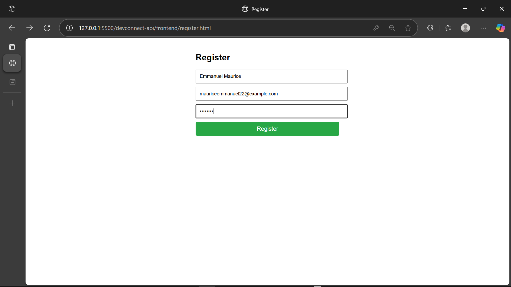
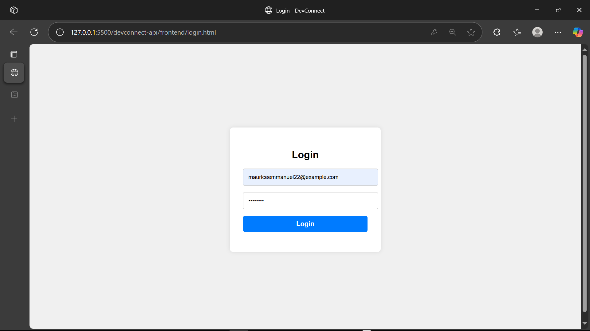
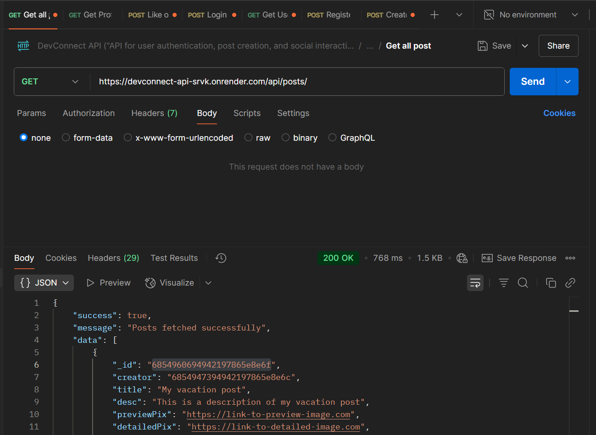
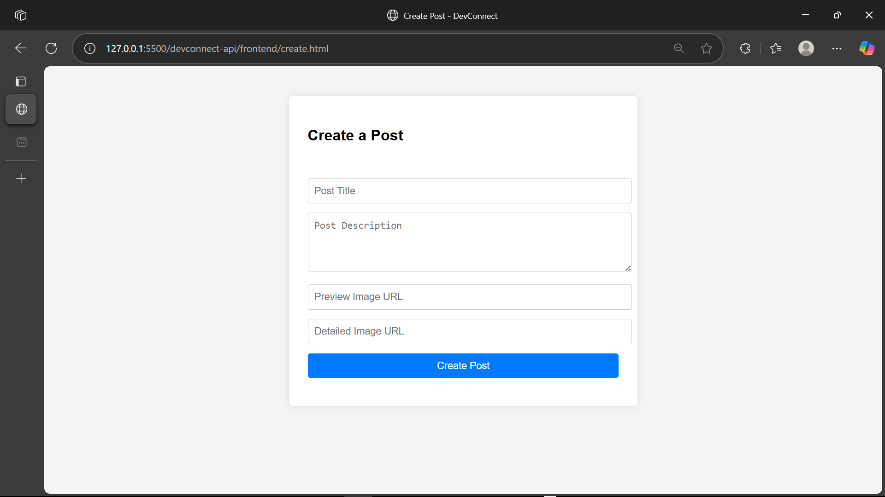
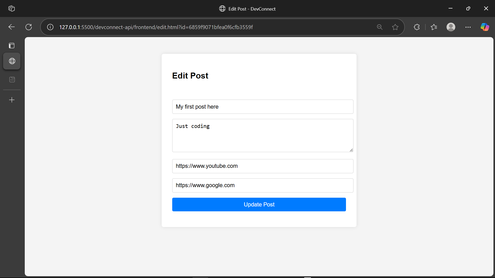
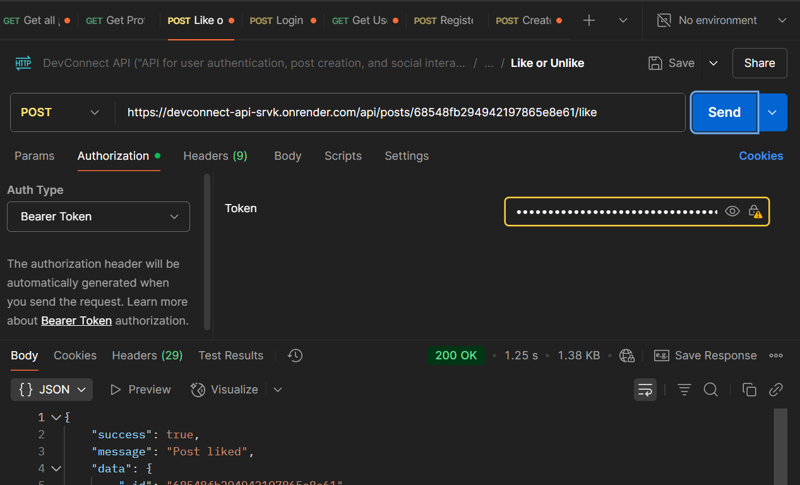
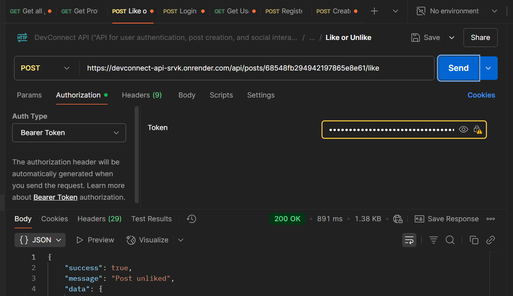
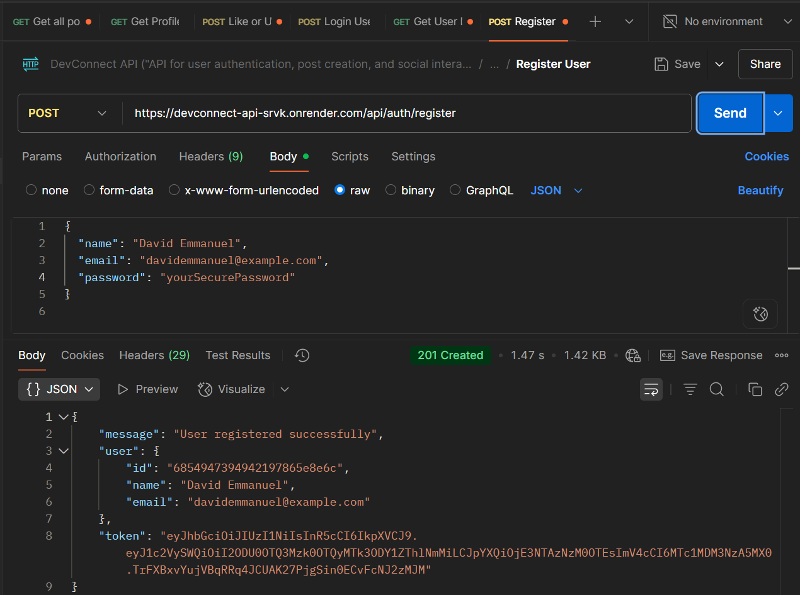
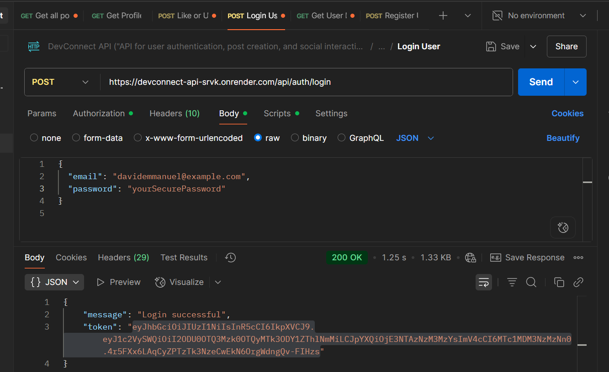
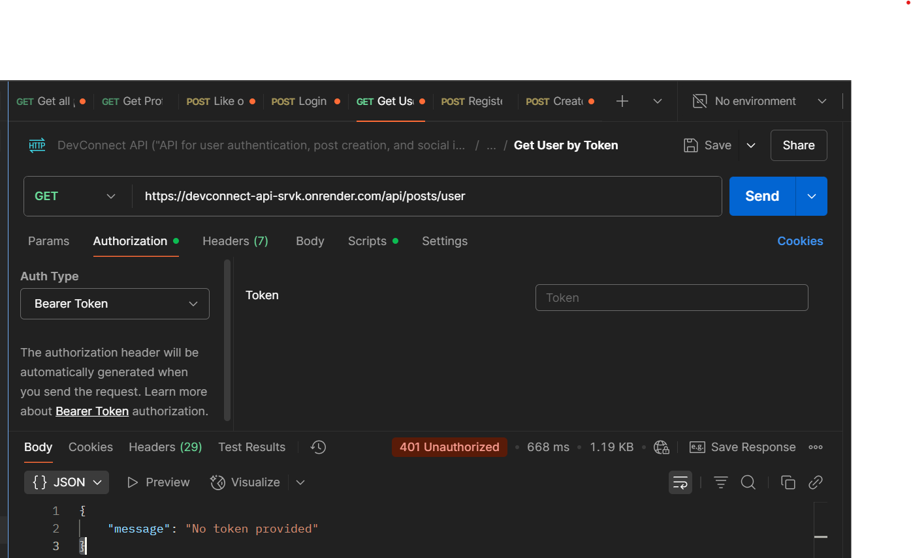

# DevConnect

DevConnect is a full-stack developer-focused social platform where users can register, log in, create posts, like/unlike posts, and manage their own content. Built with a Node.js/Express backend and a clean HTML/CSS/JS frontend.

---

## 🔗 Live Links

- **Backend API**: [https://devconnect-api.onrender.com](https://devconnect-api.onrender.com)
- **Frontend (Static)**: [https://nuel999.github.io/devconnect-frontend/](https://nuel999.github.io/devconnect-frontend)
---

## 🛠 Tech Stack

### Backend
- Node.js
- Express.js
- MongoDB + Mongoose
- JWT Authentication
- Joi Validation
- Render (for deployment)
- Postman (for testing)

### Frontend
- HTML, CSS, JavaScript (Vanilla)
- Hosted on [e.g. Netlify / Render / Vercel]

---

## 📦 Backend Features

- ✅ User Registration & Login (JWT)
- 📝 Create, Update, and Delete Posts (with ownership checks)
- 👍 Like / Unlike Posts
- 🌍 Get All Posts or Posts by Specific User
- 🔒 Protected Routes with Middleware
- 📏 Input Validation using Joi
- ⚠️ Centralized Error Handling
- ☁️ Live API on Render
- 🔐 Secure JWT middleware-based access

---

## 💡 Frontend Features

- 🌐 Public Post Feed
- 🧍 My Posts Page (only user’s created posts)
- 🧾 Create Post Page
- ✏️ Edit Post Page
- ❌ Delete Post (only by creator)
- 👍 Like / Unlike Buttons (real-time update)
- 🔐 Protected Pages (JWT required)
- 🚪 Logout Functionality
- 📸 Fully Screenshot Documented

---

## 🖼 Screenshots

### 🔐 Authentication
- **Register Page**  
  

- **Login Page**  
  

---

### 🏠 Home Page
- **Home Page with Like/Unlike Buttons**  
  

- **Get All Posts (API)**  
  

---

### 📝 Create & Edit
- **Create Post Page**  
  

- **Edit Post Page**  
  

---

### 🙋 My Posts
- **My Post Page (with Edit & Delete Buttons)**  
  

---

### ❤️ Post Interactions
- **Like Post**  
  

- **Unlike Post**  
  

---

### 🔐 API Responses
- **Register Success (API)**  
  

- **Login Success (API)**  
  

- **Protected Route Access**  
  

---

## 📁 Project Structure (Brief)

---

## 📌 Notes

- All protected routes require a valid JWT token.
- Only authenticated users can create/edit/delete their own posts.
- Likes can be toggled (like/unlike) by any logged-in user.
- Ensure `.env` and deployment configurations are properly secured.

---

## 👨‍💻 Author

Built by Emmanuel Maurice 
Feel free to fork, clone, and contribute!

